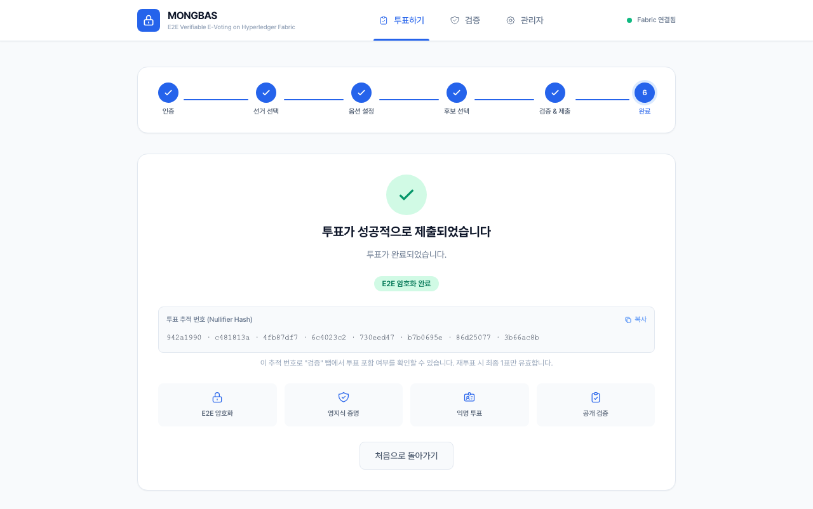
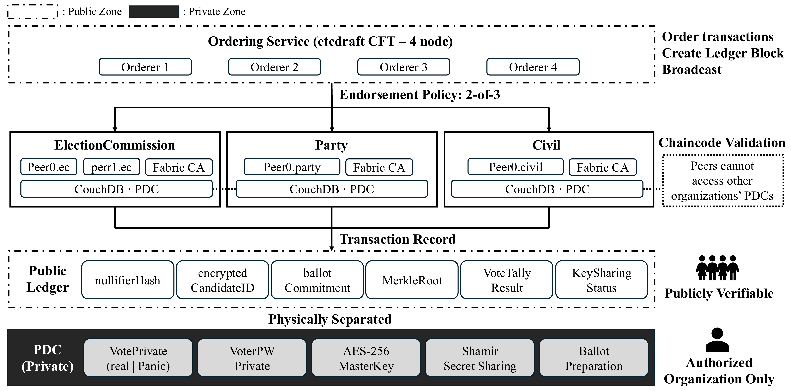
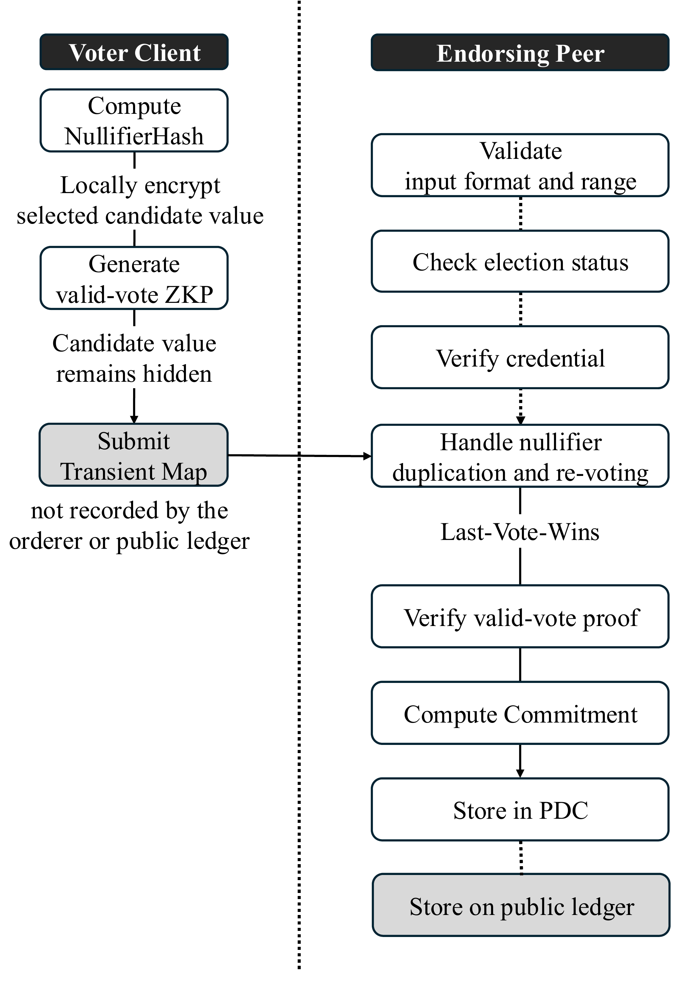
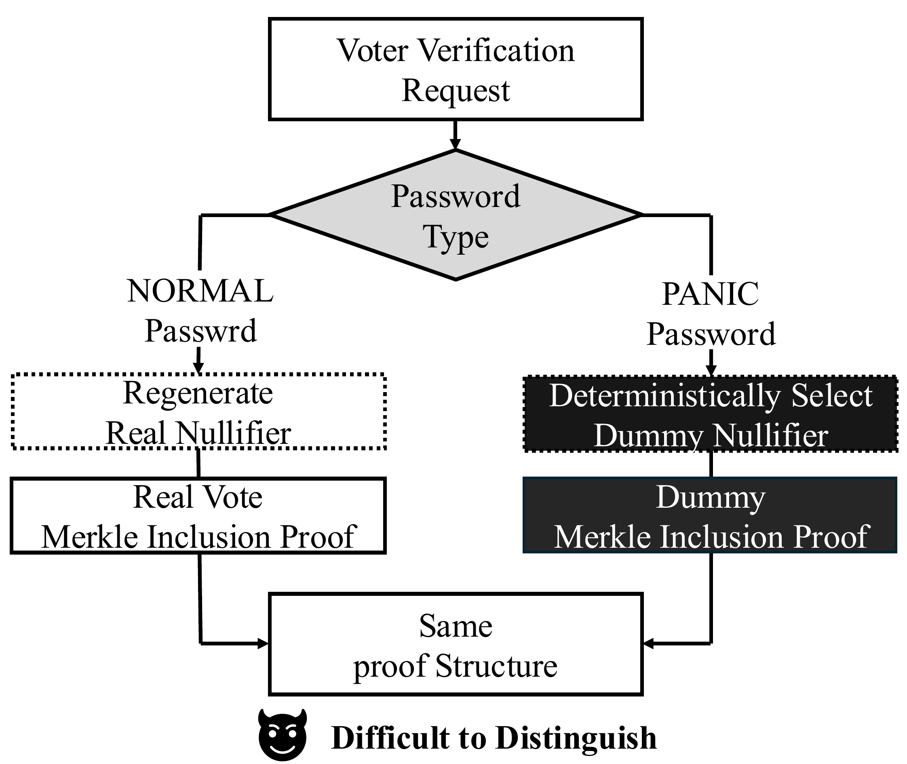
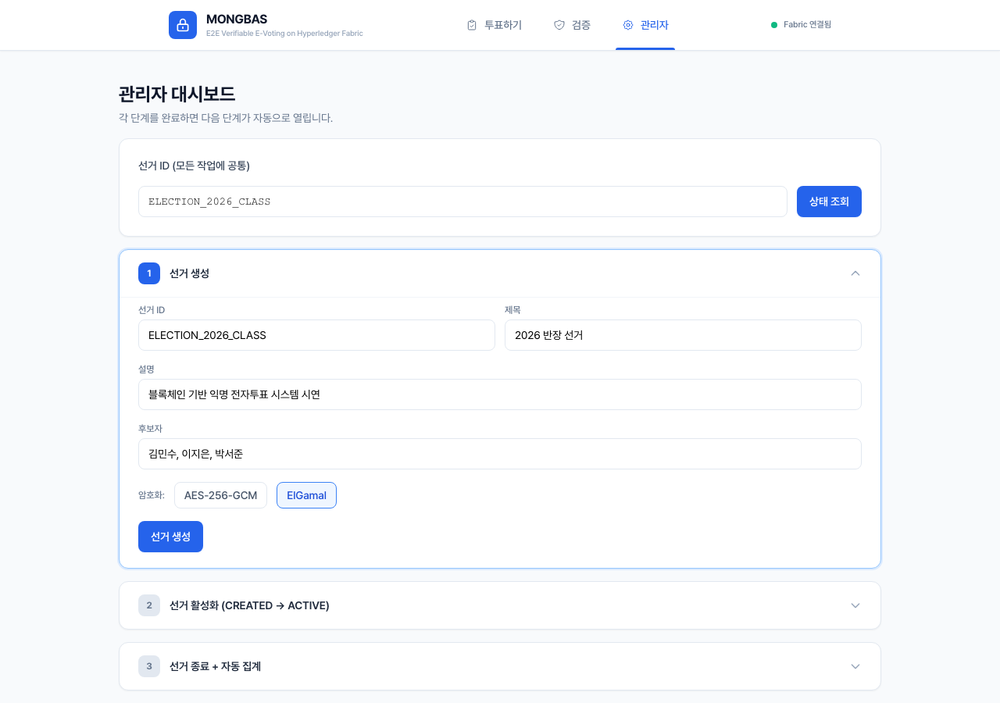
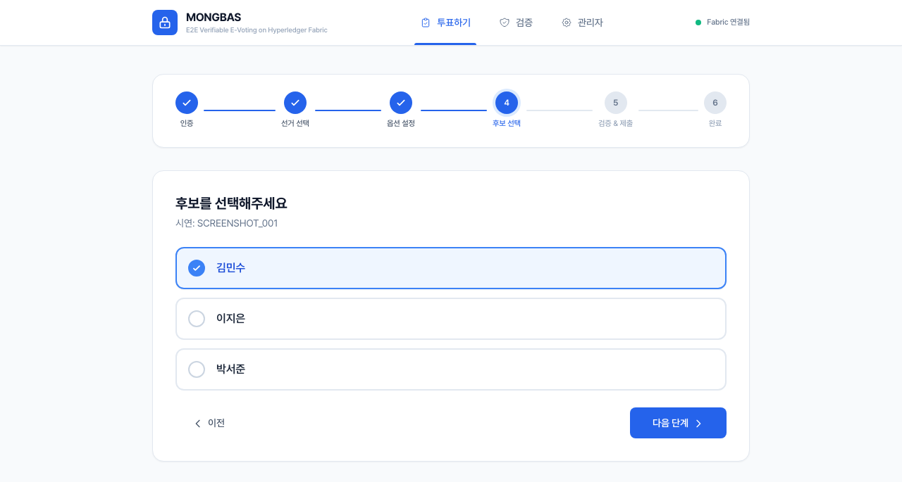
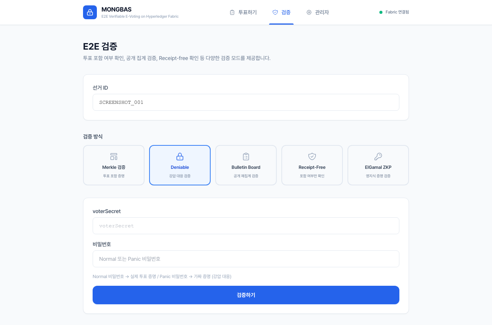
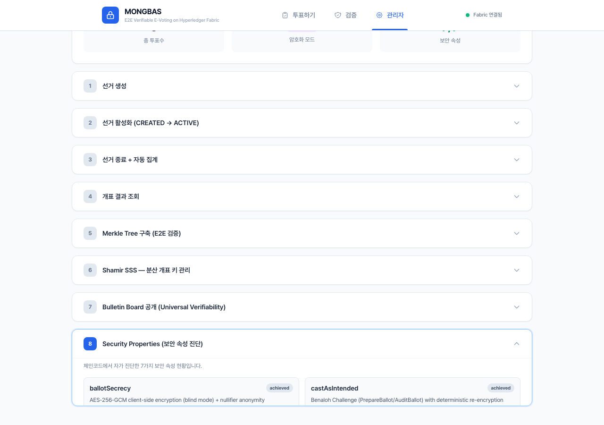

<p align="center">
  <h1 align="center">Mongbas</h1>
  <p align="center">
    <strong>Hyperledger Fabric 기반 다조직 합의 익명 전자투표 시스템</strong>
  </p>
  <p align="center">
    Anonymous E-Voting on Hyperledger Fabric 2.5:<br>
    A Research Prototype for the Verification Paradox and Coercion-Resistance Evaluation
  </p>
</p>

<p align="center">
  
  
  
  
  
</p>

<p align="center">
  
  
  
</p>

<p align="center">
  
</p>

---

## 프로젝트 소개

전자투표 시스템은 **투표 비밀성**, **검증 가능성**, **강압 저항성** 간의 구조적 긴장을 본질적으로 내포합니다. 유권자는 자신의 투표가 정확히 포함되었는지 검증할 수 있어야 하나, 이러한 검증 정보가 제3자에게 증거로 제공될 경우 선거 이후 협박의 근거가 됩니다. 본 연구는 이러한 긴장을 **검증 역설(Verification Paradox)** 로 정의합니다.

**Mongbas**는 Hyperledger Fabric 2.5 기반 3개 조직 컨소시엄 위에 **2-of-3 보증 정책**, **credential-bound nullifier**, **Exponential ElGamal 동형 집계**, **Zero-Knowledge Proof**, **독립 election bundle verifier**를 구현한 연구용 전자투표 프로토타입입니다. 불투명 deniable-proof와 PDC 분리도 실험하지만, 이를 전체 강압 저항성의 증명으로 간주하지 않습니다.

---

## 주요 기능

| 기능 | 설명 |
|------|------|
| **다조직 합의 (2-of-3)** | 3개 MSP의 2-of-3 보증 정책 구현. 기본 Docker 배포는 단일 호스트 에뮬레이션이며 기관 독립성 증거가 아님 |
| **Exponential ElGamal 동형 집계** | 개별 ballot 평문을 열지 않고 후보별 암호문을 집계하고 threshold partial proof로 검증 |
| **Chaum-Pedersen ZKP** | 이접적 OR-증명(CDS'94)으로 투표 유효성을 후보 선택 노출 없이 증명 |
| **Benaloh Challenge** | AES 준비 ballot의 audit/spoil 상태를 commit하고 브라우저 재검증. 실제 vector-v3 cast와 동일 암호 경로로 통합하는 작업은 진행 중 |
| **Authenticated DKG + threshold decryption (2-of-3)** | X25519-encrypted/Ed25519-signed Feldman contributions, three MSP transcript approvals, trustee-local shares, and CP-proved external partials. Signed complaints abort fail-closed; robust automatic exclusion remains future work |
| **부인 가능 검증 (Deniable Verification)** | 불투명 lookup capability과 8,192-byte 고정 응답으로 기존 API oracle를 제거. PDC/backend 공모·재투표 패턴은 미해결 |
| **Merkle Tree 검증** | 투표 포함/배제를 암호학적으로 증명 (E2E Verifiability) |
| **Nullifier 기반 재투표** | 동일 nullifier로 재투표 시 기존 기록 덮어쓰기 — 강압 후 자유 의사 반영 가능 |

---

## 시스템 아키텍처

<p align="center">
  
</p>

네트워크는 **ElectionCommission**(선거관리위원회), **PartyObserver**(참관정당), **CivilSociety**(시민단체) 3개 조직으로 구성됩니다. 정렬 서비스는 etcdraft 4노드 CFT 아키텍처를 채택하며, 핵심 트랜잭션은 2-of-3 보증 정책을 요구하여 단일 기관이 투표 기록이나 집계 결과를 일방적으로 갱신할 수 없습니다.

데이터는 **공개 원장**과 **PDC(Private Data Collection)** 의 두 계층으로 분리됩니다. 공개 원장에는 nullifier 해시, 암호화된 ballot, proof, Merkle root 등이 남고, PDC에는 투표 private data·credential type·deniable lookup target 등이 격리됩니다. PDC는 오더러에게 전달되지 않지만 인가된 피어/운영자는 읽을 수 있으므로 untappable channel이나 강압 저항성 증거로 간주하지 않습니다.

---

## 투표 흐름

<p align="center">
  
</p>

1. **자격증명 발급자**가 선거별 결합값을 서명하고, 브라우저가 `nullifierHash = SHA256(nullifierMaterial || electionID || blindingFactor)`를 산출합니다. 체인코드도 서명된 값으로 이를 독립 재계산합니다.
2. 선택한 후보를 **Exponential ElGamal**으로 암호화하고, **이접적 Chaum-Pedersen ZKP**를 생성합니다.
3. 암호문 + ZKP + nullifier를 **Transient Map**으로 제출합니다 (오더러 및 공개 원장에 기록되지 않음).
4. **보증 피어**는 입력 형식, 선거 상태, 자격 증명을 검증한 뒤, nullifier 중복 처리(Last-Vote-Wins)를 수행합니다.
5. ZKP 유효성을 검증한 후, **공개 원장**에는 nullifier + 암호문 + 커밋먼트를, **PDC**에는 투표자 ID + 자격 증명 유형을 저장합니다.

---

## 강압 저항 메커니즘

<p align="center">
  
</p>

유권자 브라우저는 256-bit 검증 receipt nonce와 **정상/패닉 비밀번호**로 서로 다른 domain-separated lookup capability를 만듭니다. 비밀번호와 실제 ballot nullifier는 proof API에 전송되지 않습니다.

- **정상 capability** → 실제 ballot의 Merkle 포함 증명
- **패닉 capability** → 선거 생성 시 추가된 더미 ballot의 유효한 Merkle 포함 증명

최초 Linux 공격 평가는 요청 nullifier 일치와 body size로 모드를 각각 100% 분류했습니다. `0e8f63c`/chaincode sequence 12 보완 후에는 100개 응답의 target nullifier 노출이 0개였고, 고정 8,192-byte body와 timing의 held-out classifier가 모두 15/30(50%)이었습니다. 이는 동일 호스트 API transcript oracle만 보완했음을 의미합니다. PDC/backend 공모, 자격증명 강요, forced abstention, 재투표/참여 패턴은 남아 있으므로 전체 강압 저항성은 아직 `unverified`입니다.

---

## 보안 속성 검증 상태

이 프로젝트는 7대 전자투표 보안 속성을 목표로 개발 중이지만, 현재 **7/7이 독립적으로 완전 검증되었다고 주장하지 않습니다.** `GetSecurityProperties`는 구현 기능을 나열하는 자기 선언일 뿐 보안 증명이 아닙니다.

| 속성 | 현재 구현·증거 | 주요 미해결 조건 |
|---|---|---|
| Ballot secrecy | vector ElGamal, authenticated DKG, threshold partial decryption, ballot proof, per-Unix-account custody option | separate physical administrators/HSMs, metadata privacy game, key deletion |
| Cast-as-intended | audit-or-cast 기능 및 E2E 테스트 | 엄격한 상태기계·독립 audit 증거 |
| Recorded-as-cast | Merkle inclusion, 서명 checkpoint·Mac witness의 prefix/fork 탐지 | complaint protocol과 독립 운영 witness |
| Tallied-as-recorded | 후보별 동형 집계, 2-of-3 partial proof, tamper tests | 더 넓은 공모·장애 평가 |
| Universal verifiability | standalone suite 77/77, v1/v2/v4/v5 Python/OpenSSL 교차 검증, tamper corpus, Linux·Mac witness | 실제 기관별 독립 키/운영 검증 |
| Eligibility | election-bound credential/nullifier 검증, 선거별 append-only revocation 구현 | 실제 등록부 연동, 익명 accumulator non-revocation proof, issuer 공모·직접 Fabric 공격 증거. 예측 가능한 `demo###` 계정은 자격 검증 증거에서 제외 |
| Coercion resistance | opaque proof API의 100-sample transcript gate 통과, panic/revote prototype | PDC/backend 공모, credential surrender, forced abstention, revote/participation hiding |

---

## 시연 화면

<table>
  <tr>
    <td align="center"><strong>관리자 — 선거 생성</strong></td>
    <td align="center"><strong>투표자 — 후보 선택</strong></td>
  </tr>
  <tr>
    <td></td>
    <td></td>
  </tr>
  <tr>
    <td align="center"><strong>검증자 — E2E 검증</strong></td>
    <td align="center"><strong>보안 속성 — 구현 현황(독립 검증 진행 중)</strong></td>
  </tr>
  <tr>
    <td></td>
    <td></td>
  </tr>
</table>

---

## 기술 스택

| Layer | Technology |
|-------|-----------|
| Blockchain | Hyperledger Fabric 2.5 (etcdraft CFT, 4 Orderer) |
| State DB | CouchDB 3.4 |
| Smart Contract | Go 1.21 — `chaincode/voting/voting.go` (~4,000 lines, single file) |
| Backend API | Node.js 18 + Express + `@hyperledger/fabric-gateway` |
| Frontend | React 18 + Vite + Tailwind CSS |
| Cryptography | Exponential ElGamal, Chaum-Pedersen ZKP, Shamir SSS, Merkle Tree, HMAC/Ed25519 |
| Benchmarking | Hyperledger Caliper 0.6 |
| Container | Docker + docker compose v2 |

---

## 실행 방법

> 📖 **상세 실행 가이드(도커 설치 → Fabric 부트스트랩 → 데모 원클릭 → 개발모드 → 쇼케이스 → 트러블슈팅)**: [docs/RUN_GUIDE.md](./docs/RUN_GUIDE.md)
> 부스 데모는 `./scripts/demo-up.sh` 한 번이면 됩니다(네트워크·빌드·백엔드·공개터널 자동).

### 사전 요구사항

- Docker + docker compose v2
- Node.js 18+
- Go 1.21+
- Hyperledger Fabric 2.5 binaries (`cryptogen`, `configtxgen`, `peer`, `orderer`)

> Fabric 바이너리가 없는 경우, 아래 명령으로 설치할 수 있습니다 (~280MB):
> ```bash
> curl -sSL https://bit.ly/2ysbOFE | bash -s -- 2.5.0 1.5.7
> ```

### 1. 클론

```bash
git clone https://github.com/SuBeen-Cho/blockchain_mongbas.git
cd blockchain_mongbas
```

### 2. Fabric 네트워크 시작

```bash
cd network
./scripts/network.sh up       # 인증서 생성 + 채널 생성 + 컨테이너 기동
```

### 3. 체인코드 배포

```bash
./scripts/network.sh deploy   # 체인코드 패키징 + 설치 + 승인 + 커밋 (자동)
```

### 4. 백엔드 API 서버 시작

```bash
cd ../application
cp .env.example .env          # 환경변수 설정 (.env.example 참고)
npm ci --omit=dev --omit=optional
npm start                     # http://localhost:3000
```

### 5. 프론트엔드 시작

```bash
cd ../frontend
npm ci
npm run dev                   # http://localhost:5173
```

### 종료 및 정리

```bash
cd network
./scripts/network.sh down     # 컨테이너 중지 및 제거
./scripts/network.sh clean    # 인증서 및 채널 아티팩트 전체 삭제
```

### 트러블슈팅

| 증상 | 해결 |
|------|------|
| `peer lifecycle` 명령 실패 | `fabric-samples/bin`이 `$PATH`에 포함되어 있는지 확인 |
| 체인코드 배포 시 시퀀스 에러 | `./scripts/network.sh clean` 후 `up` → `deploy` 재실행 |
| CouchDB 연결 실패 | `docker ps`로 CouchDB 컨테이너 상태 확인, 포트 충돌 여부 점검 |
| 프론트엔드 API 연결 실패 | `.env`의 `CORS_ORIGIN`에 `http://localhost:5173` 추가 |

---

## 성능 평가

### Hyperledger Caliper — CastVote TPS

| Round | Target TPS | Success | Avg Latency | Throughput |
|-------|-----------|---------|-------------|------------|
| Low | 1 TPS | 48 | 2.14s | **1.0 TPS** |
| Mid | 5 TPS | 100 | 1.39s | **4.7 TPS** |
| High | 10 TPS | 148 | 1.34s | **9.6 TPS** |

### 보안 위협 시나리오 검증

| 시나리오 | 결과 |
|----------|--------|
| A. 선관위 단독 조작 시도 | 2-of-3 보증 정책으로 차단 |
| B. 이중투표 시도 | Nullifier Eviction으로 100% 처리 |
| C. 강압 투표 API | 수정 전 100% 분류 재현; 수정 후 target 노출 0/100, size/timing held-out 각 50%. 전체 강압 저항성은 미검증 |
| D. 집계 키 단독 탈취 | 1-share 복원 실패 100%, 2-share 성공 100% |
| E. 결과 조작 외부 주장 | Merkle 검증 정확도 100% |

> 상세 평가 원자료(성능·보안)는 로컬 `docs/performance/`·`docs/security-eval/` 에 보관됩니다. (용량 문제로 GitHub에는 미포함)

---

## 팀 몽바스

2026 캡스톤디자인

<p align="center">
  <a href="https://github.com/SuBeen-Cho">
    
  </a>
  &nbsp;&nbsp;&nbsp;&nbsp;
  <a href="https://github.com/ningning56">
    
  </a>
  &nbsp;&nbsp;&nbsp;&nbsp;
  <a href="https://github.com/nanpingpingee">
    
  </a>
</p>

<p align="center">
  <strong><a href="https://github.com/SuBeen-Cho">조수빈</a></strong> (팀장)
  &nbsp;&nbsp;|&nbsp;&nbsp;
  <strong><a href="https://github.com/ningning56">정윤녕</a></strong>
  &nbsp;&nbsp;|&nbsp;&nbsp;
  <strong><a href="https://github.com/nanpingpingee">윤서현</a></strong>
</p>
